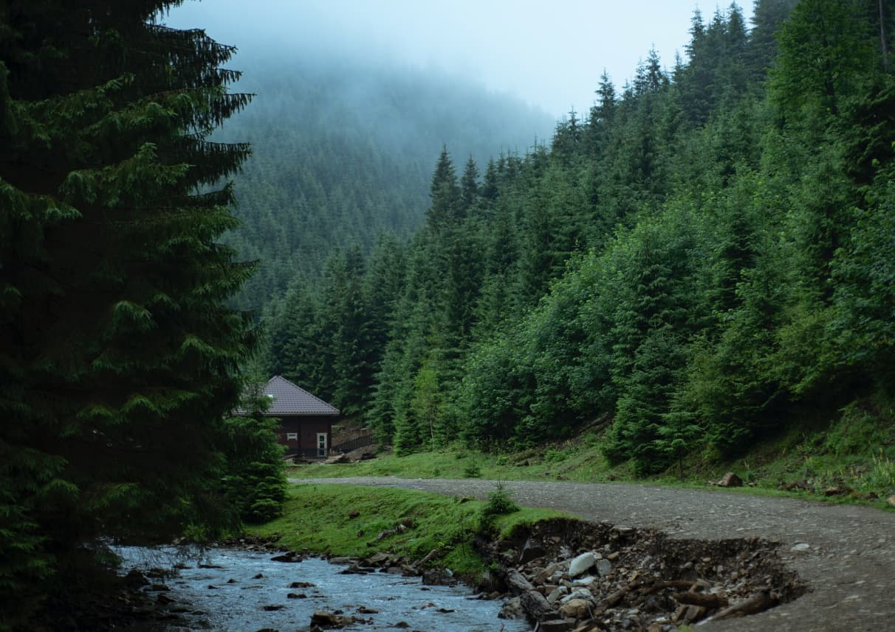

# Carp Travel App



[Carp Travel App](https://carp-travel-sigma.vercel.app/) is a web application
where you can find information about The CARPATHIAN’S.

See the live page here - [demo](https://carp-travel-sigma.vercel.app/)

# Main features

⭐ Smoth scroll:

- Developed using a custom function

⭐ Sliders:

- Developed using [Swiper](https://swiperjs.com/react).
- To create career section I used pagination and fade effect
- To create gallery section I used navigation and coverflow effect.

⭐ Forms:

- Developed using [React Hook Form](https://www.react-hook-form.com/)
- To validate the form I used [Yup](https://github.com/jquense/yup/tree/pre-v1)
- To store unsent user data to sessionStorage I used
  [React Hook Form Persist](https://github.com/tiaanduplessis/react-hook-form-persist#readme)

⭐ Notifications:

- Developed using
  [React Hot Toast](https://github.com/timolins/react-hot-toast#readme)

⭐ Responsive and adaptive layout:

- Developed with [Tailwind CSS](https://tailwindcss.com/)
- Background images are implemented via css files.
- I used density descriptors and media queries to work with images.

# Developer

The application was developed by
[Mariia Kovalova](https://www.linkedin.com/in/mariia-kova-lova/)

# Stack, technologies and libraries

1. Next.js
2. TypeScript
3. Tailwind CSS
4. React Hook Form
5. Yup
6. Swiper
7. React Hot Toast

# Project info

First, run the development server:

```bash
npm run dev
# or
yarn dev
# or
pnpm dev
```

Open [http://localhost:3000](http://localhost:3000) with your browser to see the
result.

You can start editing the page by modifying `app/page.tsx`. The page
auto-updates as you edit the file.

This project uses
[`next/font`](https://nextjs.org/docs/basic-features/font-optimization) to
automatically optimize and load Inter, a custom Google Font.
